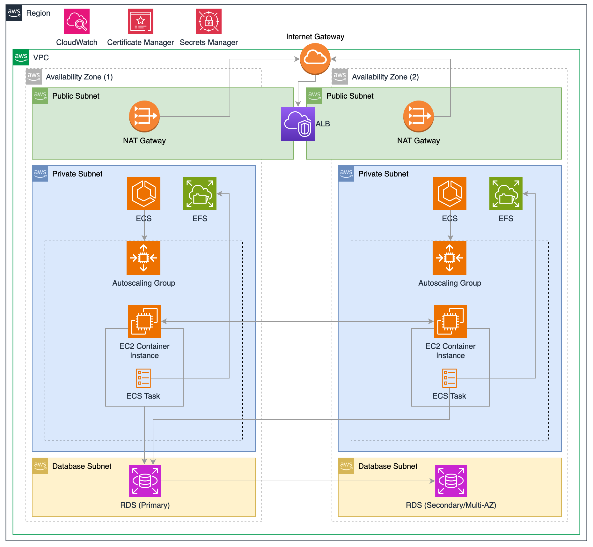

# Container Orchestration of HA Application with ECS



This repo launches a highly available WordPress application, structured as a four-tier architecture, using ECS for container orchestration.

It uses the stock [Docker Bitnami package for Wordpress](https://github.com/bitnami/containers/tree/main/bitnami/wordpress#how-to-use-this-image) and passes ENV VARIABLES for configuration.

A full breakdown can be found at my [blogpost](https://tbalza.net/container-orchestration-of-ha-application-with-ecs).

> **Warning**: Creating resources in AWS will incur costs. Therefore, always remember to use the `make destroy` command at the end to remove all resources after you're finished.

## Requirements
Install the necessary tools using [Homebrew](https://docs.brew.sh/Installation):

```bash
brew install docker
brew install terraform
brew install aws-cli
```

## Setup DNS with CloudFlare
[Setup Cloudflare DNS Nameservers](https://www.namecheap.com/support/knowledgebase/article.aspx/9607/2210/how-to-set-up-dns-records-for-your-domain-in-a-cloudflare-account/)

[Create Cloudflare API Token](https://developers.cloudflare.com/fundamentals/api/get-started/create-token/)

Create a `secrets.tf` file
```hcl
variable "cloudflare_api_token" {
  default   = "insert-API-key-here"
  type      = string
  sensitive = true
}

variable "cloudflare_zone_id" {
  default   = "insert-cloudflare-zone-here"
  type      = string
  sensitive = true
}
```

The DNS section is designed under the assumption that you possess a domain, for example, `domain.com`. It will then proceed to create a subdomain, `wp.domain.com`, and dynamically generate and validate an SSL certificate for this subdomain.

## Clone the repository and set up your infrastructure:

```bash
git clone https://github.com/tbalza/terraform-docker-wordpress.git
cd terraform-docker-wordpress
terraform init
terraform plan
terraform apply
```

After applying the Terraform configuration, check the outputs for the ALB DNS and test the configured server.

To remove the deployed resources when finished:

```bash
terraform destroy
```

## Known Limitations

**Issues with 'DRAINING' Status:**

When attempting to delete an ECS Service, ensure all running tasks are halted and the task definitions are deregistered. This allows the service to be successfully removed without lingering in the 'DRAINING' status. If problems persist, executing `terraform destroy` again can aid in clearing up any residual resources.
